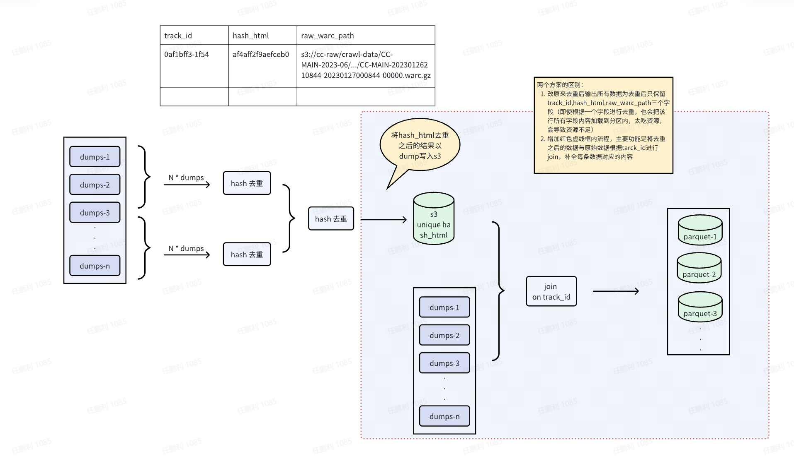

# 预去重按照如下顺序执行

## 流程方案



## 执行步骤

### cc_dedup_fir.ipynb

输入参数：

```
DUMPS: cc warc 文件对应的dump
CC_WARC: cc warc 文件对应的 s3 路径，不包含 dump， 程序依据不同dump分批执行
output_path: s3 输出路径
```

输出数据结构：

```json
{
    "track_id": "a6dcf951-42de-4ec6-a0d5-9af1ee73ab03",
    "sub_path": "dump",
    "hash_html": "0005dcd7fdce5a28efb9eec848b2caf95da971e1d58598e3ff52c3c4eb66882d"
}
```

### cc_dedup_sec.ipynb

输入参数：

```
DUMPS: cc warc 文件对应的dump
base_input_path：第一步 cc_dedup_fir.ipynb 执行产生的 s3 路径，不包含dump，程序依据不同dump分批执行
这里输入路径需要以 s3a 开头，否则程序会报错
already_exist_id_path：存放已经去重的id path
output_path: s3 输出路径
```

输出数据结构：

```json
{
    "track_id": "a6dcf951-42de-4ec6-a0d5-9af1ee73ab03",
    "sub_path": "dump",
    "hash_html": "0005dcd7fdce5a28efb9eec848b2caf95da971e1d58598e3ff52c3c4eb66882d"
}
```

### cc_dedup_thi.ipynb

输入参数：

```
DUMPS: cc warc 文件对应的dump
CC_WARC: cc warc 文件对应的 s3 路径，不包含 dump， 程序依据不同dump分批执行
base_unique_path: 第二步 cc_dedup_sec.ipynb 执行产生的 s3 路径
output_path: s3  输出路径
```

输出数据结构：

```json
{
    "date": 1369152963,
    "response_header": {
        "Connection": "close",
        "Content-Type": "text/html"
    },
    "track_id": "0008dd8c-4f4b-424a-af7b-ebd73fabc49a",
    "remark": {
        "warc_headers": {
            "WARC-IP-Address": "186.192.82.88"
        }
    },
    "html": "<!DOCTYPE html PUBLIC \"-//W3C//DTD XHTML 1.0 Transitional//EN\" </html>",
    "content_charset": "utf-8",
    "content_length": 97605,
    "url": "http://www.test.com/",
    "status": 200,
    "sub_path": "dump",
    "raw_warc_path": "s3://xxx"  // cc源数据path
}
```
