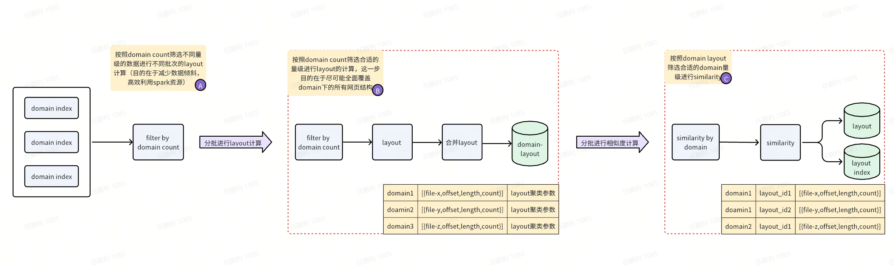

# layout 聚类

## 流程方案



## 输入参数

```
DATA_SIZE_PER_BATCH: 每个批次的数据量

MAX_LAYOUTLIST_SIZE: 聚类列表最大长度
SIMILARITY_THRESHOLD: 相似度阈值
TIMEOUT_SECONDS: 聚类超时时间
SIM_TIMEOUT_SECONDS: 相似度超时时间
MAX_OUTPUT_ROW_SIZE: 输出数据行大小限制
MAX_OUTPUT_FILE_SIZE: 输出文件大小限制
NUM_PARTITIONS: spark分区设置
WRITE_NUM_PARTITIONS: spark 相似度写入分区设置
RATE_MAP: 聚类数据筛选标准

ERROR_PATH: 异常日志地址

INPUT_PATH: choose domain 输入数据地址
CHOOSE_DOMAIN_OUTPUT_PATH: choose domain输出数据地址

CLUSTER_LAYOUT_BASE_OUTPUT_PATH: layout输出数据基础地址
BASE_DOMAIN_PATH: 过程中 valid domain 数据基础地址
BASE_BATCH_PATH: 过程中 batch layout 数据基础地址

LAYOUT_SIM_BASE_OUTPUT_PATH: layout data输出数据基础地址

LAYOUT_INDEX_BASE_OUTPUT_PATH: layout index输出数据基础地址
```

## 输出数据结构

#### layout data

```json
{
    "track_id": "31f5a241-f6d8-40f5-93c8-72b61c5dd790",
    "html": "<!DOCTYPE html>\n<html>...</html>",
    "url": "http://www.test.com/",
    "layout_id": "www.test.com_0",
    "max_layer_n": 6,
    "url_host_name": "www.test.com",
    "raw_warc_path": "s3://xxx"
}
```

#### layout index

```json
{
  "layout_id": "www.test.com_0",
  "url_host_name": "www.test.com",
  "count": 50,
  "files": [
    {
      "filepath": "s3://xxx",  // 文件路径
      "offset": 0,                          // 该layout_id数据在文件中的offset
      "length": 50,                         // 该layout_id数据在文件中的length
      "record_count": 50,                       // 该filepath 记录该layout_id的数量
      "timestamp": "2025-06-09 20:04:04"                    // 最后更新时间戳
    }
  ]
}
```
