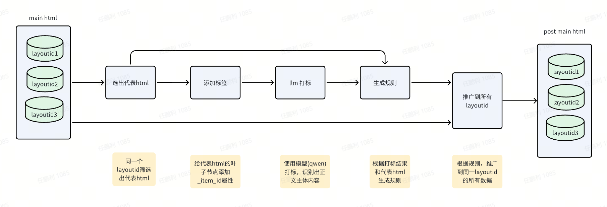

# main html后处理

## 流程方案

## 执行步骤

| filename         | function                    | input & input_type                                                              | output_type                | 实现功能       |
| :--------------- | :-------------------------- | :------------------------------------------------------------------------------ | :------------------------- | :------------- |
| choose_html.py   | select_typical_html         | html_strs: html迭代器                                                           | str                        | 选出代表html   |
| add_tags.py      | process_html                | input_html: str                                                                 | str                        | 添加itemid     |
| post_llm.py      | get_llm_response            | api_key: str, url: str, html_id_str: str, model_name: str                       | Dict\[str, int\] \[^1\]    | 模型打标       |
| generate_rule.py | restore_html_trim_ends_only | processed_html: str, llm_response: Dict\[str, int\](get_llm_response的输出结果) | Dict\[str, object\] \[^2\] | 生成删除规则   |
| post_mapping.py  | mapping_html_by_rules       | html_str: str, post_delete_node: List\[object\] \[^3\]                          | str                        | 推广到所有数据 |

\[^1\]

<pre>
'''json

{"item_id 1": 0, "item_id 2": 0, "item_id 3": 1, "item_id 4": 1, "item_id 5": 1, "item_id 6": 1, "item_id 7": 1}  # 0：删除；1：保留

'''
</pre>

\[^2\]

<pre>
'''json

{
"html": "&lt;div&gt;&lt;div class=&quot;content&quot;&gt; &lt;div class=&quot;container&quot;&gt;&lt;dl class=&quot;col-xs-9 col-sm-8&quot;&gt;&lt;dt&gt;&lt;h1&gt;TFI Bearing
Co.,Ltd&lt;/h1&gt;&lt;/dt&gt;&lt;dd&gt;&lt;strong&gt;Triple-Row Slewing&lt;/strong&gt;&lt;strong&gt;Silverthin Slewing Rings&lt;/strong&gt;&lt;strong&gt;Skf Slewing
Bearing&lt;/strong&gt;&lt;/dd&gt;&lt;/dl&gt;&lt;/div&gt;&lt;/div&gt;&lt;/div&gt;",  # 选出的代表main html经过处理之后的新html
"post_delete_node": [  # 删除规则
{
"del_location": "start",  # 删除的位置【start（头部） or end（尾部）】
"xpath": "/div/div[1]/div/div/div[1]",  # 删除节点的xpath
"tag": "div",  # 删除节点的标签名称
"attributes": {"class": "left-content"},  # 删除节点的属性
"index_in_parent": 0,  # 删除节点在父节点的索引
"parent_xpath": "/div/div[1]/div/div",  # 删除节点的父节点的xpath
"parent_tag": "div",  # 删除节点的父节点的标签名称
"parent_attributes": {"class": "main-content fl-clr"}  # 删除节点的父节点的属性
},
{
"del_location": "end",
"xpath": "/div/div[3]",
"tag": "div",
"attributes": {"class": "footer"},
"index_in_parent": 2,
"parent_xpath": "/div",
"parent_tag": "div",
"parent_attributes": {}
}
]
}

'''
</pre>

\[^3\]

<pre>
'''json
[
{
"del_location": "start",  # 删除的位置【start（头部） or end（尾部）】
"xpath": "/div/div[1]/div/div/div[1]",  # 删除节点的xpath
"tag": "div",  # 删除节点的标签名称
"attributes": {"class": "left-content"},  # 删除节点的属性
"index_in_parent": 0,  # 删除节点在父节点的索引
"parent_xpath": "/div/div[1]/div/div",  # 删除节点的父节点的xpath
"parent_tag": "div",  # 删除节点的父节点的标签名称
"parent_attributes": {"class": "main-content fl-clr"}  # 删除节点的父节点的属性
},
{
"del_location": "end",
"xpath": "/div/div[3]",
"tag": "div",
"attributes": {"class": "footer"},
"index_in_parent": 2,
"parent_xpath": "/div",
"parent_tag": "div",
"parent_attributes": {}
}
]

'''
</pre>
